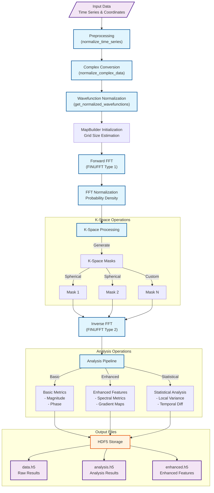
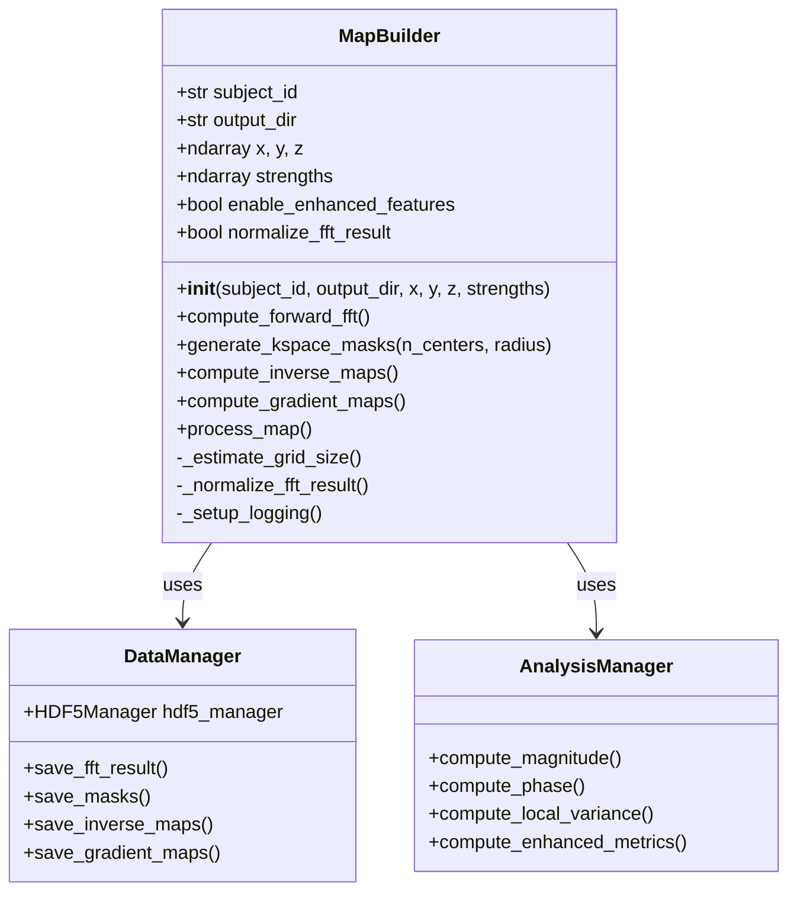
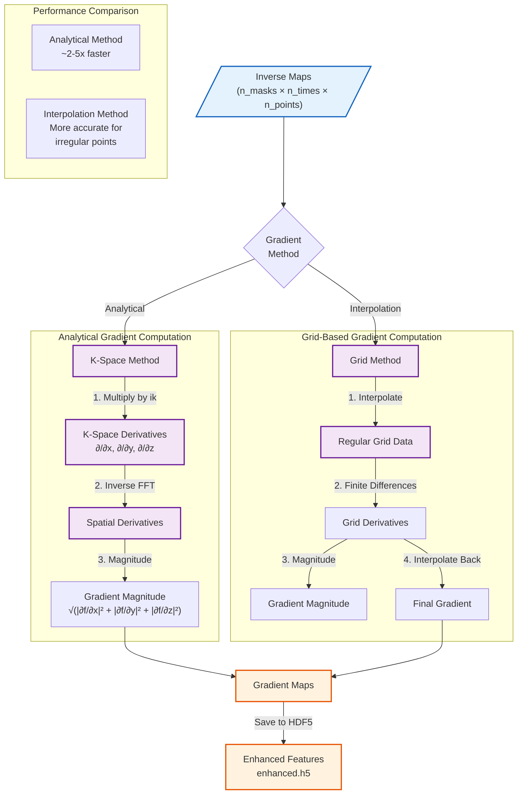

# QM FFT Analysis Package

This package provides tools for analyzing 3D data, potentially representing quantum mechanical properties or other spatial fields, using Non-Uniform Fast Fourier Transforms (NUFFT) via the FINUFFT library.

## Developer Information
**Developer:** Dilanjan DK  
**Contact:** ddiyabal@uwo.ca

## Features

*   **NUFFT Implementation:** Leverages FINUFFT for efficient transformation between non-uniform points and a uniform grid.
*   **Map Building:** Transforms scattered 3D data (strengths at x, y, z coordinates) into a uniform k-space representation.
*   **K-Space Masking:** Allows generation and application of spherical masks in k-space to isolate specific frequency components.
*   **Inverse Mapping:** Transforms masked k-space data back to the original non-uniform points.
*   **Gradient Calculation:** Computes the spatial gradient magnitude of the inverse maps using either interpolation or analytical methods.
*   **Analysis Metrics:** Calculates additional metrics directly on the non-uniform inverse maps, including magnitude, phase, local variance, and temporal differences.
*   **Enhanced HDF5 Storage:** Efficiently organizes and compresses results in HDF5 format with proper grouping and dataset management.
*   **Visualization:** Generates interactive 3D volume plots using Plotly.
*   **Batch Processing:** Supports processing multiple sets of strength data (`n_trans`) associated with the same coordinates (e.g., time series).
*   **Scalability:** Tested and optimized for large datasets (50,000+ points, 100+ time points).
*   **Logging:** Provides detailed logging of the processing steps.
*   **Directory Structure:** Organizes outputs into `data.h5`, `analysis.h5`, and `enhanced.h5` files for each subject ID.

### Enhanced Features (Optional)

The package includes enhanced features that can be enabled as needed:

*   **Analytic Radial Gradient:** Efficiently computes gradient maps directly in k-space using a single inverse NUFFT (2-5x faster).
*   **Spectral Metrics:**
    * **Spectral Slope:** Measures the power-law exponent of the frequency distribution.
    * **Spectral Entropy:** Quantifies the diversity of frequency components.
    * **Anisotropy/Orientation Dispersion:** Measures spatial directionality in k-space.
*   **Higher-Order Moments:** Calculates skewness and kurtosis of the inverse maps.
*   **HRF Deconvolution-Based Excitation Maps:** Estimates neuronal activity by deconvolving the hemodynamic response function.

See the [Enhanced Features Guide](docs/enhanced_features_guide.md) for detailed documentation.

## Performance

The package has been tested with various data sizes:
- Small datasets: 1,000 points, 5 time points (~2MB total output)
- Medium datasets: 5,000 points, 10 time points (~18MB total output)
- Large datasets: 50,000 points, 100 time points (~1.7GB total output)

Key performance characteristics:
- Forward FFT scales efficiently with grid size
- Analytical gradient computation provides 2-5x speedup over interpolation
- HDF5 compression reduces storage requirements
- Memory usage scales linearly with data size

For detailed performance metrics and optimization strategies, see the [Technical Reference](docs/technical_reference.md).

## Workflow

The package implements a computational pipeline that processes 3D data using the following workflow:

```mermaid
graph LR
    A[Input Data\n3D Coordinates & Strengths] --> B[Forward FFT\nSource Space to K-Space]
    B --> C[K-Space Masking\nFrequency Selection]
    C --> D[Inverse FFT\nK-Space to Source Space]
    D --> E[Gradient Analysis\nDetect Spatial Changes]
    E --> F[Results\nMaps & Visualizations]
    
    style A fill:#f9f9f9,stroke:#333,stroke-width:1px
    style B fill:#d1e7dd,stroke:#333,stroke-width:1px
    style C fill:#d1e7dd,stroke:#333,stroke-width:1px
    style D fill:#d1e7dd,stroke:#333,stroke-width:1px
    style E fill:#cff4fc,stroke:#333,stroke-width:1px
    style F fill:#f8d7da,stroke:#333,stroke-width:1px
```



For a comprehensive explanation of the package's functionality, including detailed technical information about FFT functions, neuroimaging applications, and k-space masking techniques, see the [Technical Reference](docs/technical_reference.md).

## Installation

See the [HOW-TO.md](./HOW-TO.md) guide for detailed installation steps using `venv` or `conda`.

## Usage

Detailed usage instructions and a practical example can be found in the [HOW-TO Guide](./HOW-TO.md).

For in-depth information on specific components, refer to the [Documentation](#documentation) section below.

### Using Enhanced Features

To use the enhanced features, initialize the `MapBuilder` with the `enable_enhanced_features` parameter:

```python
from QM_FFT_Analysis.utils.map_builder import MapBuilder

map_builder = MapBuilder(
    subject_id="example", 
    output_dir="./output", 
    x=x_coords, 
    y=y_coords, 
    z=z_coords, 
    strengths=strengths,
    enable_enhanced_features=True  # Enable enhanced features
)

# Use analytical gradient method (faster)
map_builder.compute_gradient_maps(use_analytical_method=True)

# Compute enhanced spectral metrics
enhanced_metrics = map_builder.compute_enhanced_metrics(
    metrics_to_run=['spectral_slope', 'spectral_entropy', 'anisotropy']
)
```

See the [Enhanced Features Example Notebook](notebooks/Enhanced_Features_Example.ipynb) for a complete demonstration.

### Using the Standalone Analytical Gradient Function

For cases where you only need to compute the analytical radial gradient without using the full `MapBuilder` pipeline, you can directly use the `calculate_analytical_gradient` function:

```python
from QM_FFT_Analysis.utils import calculate_analytical_gradient
import numpy as np

# Example data
n_points = 1000
n_trans = 3  # Number of time points
x = np.random.uniform(-np.pi, np.pi, n_points)
y = np.random.uniform(-np.pi, np.pi, n_points)
z = np.random.uniform(-np.pi, np.pi, n_points)
strengths = np.random.randn(n_trans, n_points) + 1j * np.random.randn(n_trans, n_points)

# Calculate the analytical gradient
results = calculate_analytical_gradient(
    x=x, y=y, z=z, strengths=strengths,
    subject_id="subject_001",
    output_dir="./output",
    # Optional parameters:
    # nx=64, ny=64, nz=64,  # Grid dimensions (estimated by default)
    # eps=1e-6,             # FINUFFT precision
    # export_nifti=True,    # Export results to NIfTI format
    # affine_transform=None # Affine transformation matrix for NIfTI
    # average=True          # Compute average across time points (default=True)
)

# Access results
gradient_map_nu = results['gradient_map_nu']      # On original non-uniform points
gradient_map_grid = results['gradient_map_grid']  # Interpolated to regular grid
fft_result = results['fft_result']                # Forward FFT result

# If average=True was used
if 'gradient_average_nu' in results:
    gradient_avg_nu = results['gradient_average_nu']    # Average gradient on points
    gradient_avg_grid = results['gradient_average_grid'] # Average on grid

# The function saves results to:
# - output_dir/subject_id/Analytical_FFT_Gradient_Maps/average_gradient.h5 (if average=True)
# - output_dir/subject_id/Analytical_FFT_Gradient_Maps/AllTimePoints/all_gradients.h5
```

This standalone function implements the exact analytical radial gradient as described in the paper "Multiscale k-Space Gradient Mapping in fMRI: Theory, Shell Selection, and Excitability Proxy", using the mathematical formula:

$$\frac{\partial f}{\partial r}(\mathbf{x}) = \mathcal{F}^{-1}\bigl\{\,i2\pi\,\|\mathbf{k}\|\,F(\mathbf{k})\bigr\}$$

#### Key Features of the Standalone Function:

- **Automatic K-Space Optimization**: Automatically calculates optimal grid size and k-space extent based on input data distribution.
- **Time Averaging**: Can compute and save the average gradient over multiple time points.
- **NIfTI Export**: Optional export to NIfTI format for neuroimaging applications.
- **Comprehensive Outputs**: Returns both non-uniform and gridded gradient maps, along with k-space information.
- **Organized Results**: Saves results in a structured directory hierarchy with HDF5 files.

For a comprehensive explanation of the function, including theory, parameters, examples, and troubleshooting, see the [Analytical Gradient Guide](docs/analytical_gradient_guide.md).

## Output Structure

The package generates three HDF5 files for each subject:

1. `data.h5`: Contains raw computational results
   - Forward FFT results
   - K-space masks
   - Inverse maps
   - Gradient maps

2. `analysis.h5`: Contains analysis results
   - Magnitude and phase calculations
   - Local variance metrics
   - Temporal difference calculations
   - Analysis summary group

3. `enhanced.h5`: Contains enhanced feature results (if enabled)
   - Spectral metrics (slope, entropy)
   - Analytical gradient maps
   - Higher-order moments
   - Excitation maps

Each file uses HDF5 compression and proper dataset organization for efficient storage and access.

## Contributing

(Add contribution guidelines if applicable)

## License

This package is private and copyrighted.

All rights reserved. Unauthorized copying, distribution, modification, or use of the software, in whole or in part, is strictly prohibited without the express written permission of the copyright holders (Dilanjan DK and BrainLab).

For licensing or usage inquiries, contact: ddiyabal@uwo.ca

## Documentation

The package includes comprehensive documentation for users and developers:

### Core Documentation
* [Technical Reference](docs/technical_reference.md): Comprehensive explanation of FFT functions, neuroimaging applications, and k-space masking techniques
* [Comprehensive Guide](docs/comprehensive_guide.myst.md): Detailed overview of the package's functionality and applications
* [Map Builder Guide](docs/map_builder_guide.md): Focused explanation of the `MapBuilder` class and its methods
* [Enhanced Features Guide](docs/enhanced_features_guide.md): Details on optional advanced features and spectral metrics
* [Analytical Gradient Guide](docs/analytical_gradient_guide.md): Detailed guide to the standalone analytical gradient function

### Additional Resources
* [Analysis Module Guide](docs/analysis_module_guide.md): Details on analytical functions for non-uniform inverse maps
* [Testing Documentation](docs/testing.md): Information on testing procedures and validation

### Installation and Usage
* [HOW-TO Guide](./HOW-TO.md): Step-by-step instructions for installation and basic usage

### Jupyter Notebooks
* [Interactive Guide](docs/comprehensive_guide.ipynb): Jupyter notebook with interactive examples and visualizations
* [Enhanced Features Example](notebooks/Enhanced_Features_Example.ipynb): Demonstration of enhanced features

## References

This package relies on the FINUFFT library for efficient non-uniform Fast Fourier Transforms. If you use this package in your research, please cite the appropriate FINUFFT papers:

For CPU implementation (used in this package):
* [FIN] Barnett, A. H., Magland, J., & af Klinteberg, L. (2019). A Parallel Nonuniform Fast Fourier Transform Library Based on an "Exponential of Semicircle" Kernel. SIAM Journal on Scientific Computing, 41(5), C479–C504. https://doi.org/10.1137/18M1173014 ([arXiv version](https://arxiv.org/abs/1808.06736))

* [B20] Barnett, A. H. (2021). Aliasing error of the exp⁡(β√(1-z²)) kernel in the nonuniform fast Fourier transform. Applied and Computational Harmonic Analysis, 51, 1-16. https://doi.org/10.1016/j.acha.2020.08.007 ([arXiv version](https://arxiv.org/abs/1910.00850))

For GPU implementation (if using cuFINUFFT):
* [S21] Shih, Y.-H., Wright, G., Andén, J., Blaschke, J., & Barnett, A. H. (2021). cuFINUFFT: a load-balanced GPU library for general-purpose nonuniform FFTs. PDSEC2021 workshop of the IPDPS2021 conference. ([arXiv version](https://arxiv.org/abs/2102.08463))

* FINUFFT GitHub Repository: https://github.com/flatironinstitute/finufft

For a complete list of references and academic background, see the [Technical Reference](docs/technical_reference.md#references) document.

## Containerization

A `Dockerfile` is provided to build a container image with the package and its dependencies installed.

```bash
docker build -t qm-fft-analysis .
docker run -it --rm -v $(pwd)/output:/app/output qm-fft-analysis python your_script.py 
```

Replace `your_script.py` with the script you want to run inside the container. The `-v` flag mounts your local `output` directory to `/app/output` inside the container, allowing you to retrieve results.

```python
import numpy as np
from QM_FFT_Analysis.utils.preprocessing import get_normalized_wavefunctions_at_times
from QM_FFT_Analysis.utils.map_builder import MapBuilder

# 1. Load or generate your time_series_data (sources, time) and 1D coordinates (x, y, z)
n_sources = 50
n_time = 200
x_coords = np.random.uniform(-np.pi, np.pi, n_sources)
y_coords = np.random.uniform(-np.pi, np.pi, n_sources)
z_coords = np.random.uniform(-np.pi, np.pi, n_sources)
time_series_data = np.random.randn(n_sources, n_time)

# 2. Preprocess data for multiple time points
time_indices_to_analyze = [50, 100, 150]
normalized_wavefunctions_stack = get_normalized_wavefunctions_at_times(
    time_series_data=time_series_data, 
    time_indices=time_indices_to_analyze,
    time_axis=1, # Assuming time is axis 1
    source_axis=0 # Assuming sources are axis 0
)
# Shape is (n_times, n_sources)

# 3. Use MapBuilder
builder = MapBuilder(
    subject_id='ExampleSubject', 
    output_dir='./output', 
    x=x_coords, 
    y=y_coords, 
    z=z_coords, 
    strengths=normalized_wavefunctions_stack,
    dtype='complex64', # Match preprocessing output
    normalize_fft_result=True
)
# Builder automatically detects n_trans = len(time_indices_to_analyze)

# 4. Run analysis (computes for all time points in strengths)
builder.compute_forward_fft()
# builder.generate_kspace_masks(...)
# builder.compute_inverse_maps()
# builder.compute_gradient_maps()

# Results (e.g., gradients) will have shape (n_trans, nx, ny, nz)
# Access results for a specific time point, e.g., gradients for time_indices_to_analyze[1]:
# if builder.gradient_maps:
#     gradient_map_t1 = builder.gradient_maps[0][1, :, :, :] # Assuming 1 mask, select 2nd time point ([1])
#     # Visualize this 3D map separately if needed
#     # builder.generate_volume_plot(gradient_map_t1, "gradient_map_t1.html")

```

## Complete Pipeline Execution

### Basic Usage

```python
import numpy as np
from QM_FFT_Analysis.utils.map_builder import MapBuilder

# 1. Prepare your data
n_points = 5000  # Number of spatial points
n_times = 10    # Number of time points/transforms

# Generate or load your coordinates
x = np.random.uniform(-np.pi, np.pi, n_points)
y = np.random.uniform(-np.pi, np.pi, n_points)
z = np.random.uniform(-np.pi, np.pi, n_points)

# Generate or load your strength values (complex-valued)
strengths = np.random.randn(n_times, n_points) + 1j * np.random.randn(n_times, n_points)

# 2. Initialize MapBuilder
map_builder = MapBuilder(
    subject_id='example_subject',
    output_dir='/path/to/output',
    x=x, 
    y=y, 
    z=z,
    strengths=strengths,
    enable_enhanced_features=True,  # Enable additional analysis features
    normalize_fft_result=True       # Normalize FFT results
)

# 3. Run the complete pipeline
map_builder.process_map(
    n_centers=2,              # Number of spherical masks
    radius=0.5,              # Radius of masks in k-space
    analyses_to_run=[        # List of analyses to perform
        'magnitude',
        'phase',
        'spectral_slope',
        'spectral_entropy'
    ]
)
```

### Full Parameter Reference

#### MapBuilder Initialization

```python
MapBuilder(
    subject_id: str,          # Unique identifier for the subject
    output_dir: str,          # Directory for output files
    x: np.ndarray,           # X coordinates (shape: n_points)
    y: np.ndarray,           # Y coordinates (shape: n_points)
    z: np.ndarray,           # Z coordinates (shape: n_points)
    strengths: np.ndarray,   # Complex strengths (shape: n_times × n_points)
    
    # Optional parameters
    enable_enhanced_features: bool = False,  # Enable advanced analysis
    normalize_fft_result: bool = True,       # Normalize FFT results
    eps: float = 1e-6,                      # FINUFFT precision
    dtype: str = 'complex64',               # Data type for calculations
    estimate_grid: bool = True,             # Auto-estimate grid size
    nx: int = None,                         # Manual grid size X (if not estimating)
    ny: int = None,                         # Manual grid size Y
    nz: int = None,                         # Manual grid size Z
    upsample_factor: float = 2.0,           # Grid upsampling factor
    keep_fft_result: bool = True            # Keep FFT results in memory
)
```

#### Process Map Parameters

```python
process_map(
    # K-space mask parameters
    n_centers: int = 3,           # Number of spherical masks
    radius: float = 0.5,          # Mask radius (0 to 1)
    random_seed: int = None,      # Seed for random mask centers
    
    # Analysis parameters
    analyses_to_run: List[str] = [
        'magnitude',              # Basic magnitude analysis
        'phase',                  # Phase analysis
        'local_variance',         # Local spatial variance
        'temporal_diff',          # Temporal differences
        'spectral_slope',         # Spectral slope (enhanced)
        'spectral_entropy',       # Spectral entropy (enhanced)
        'anisotropy'             # Spatial anisotropy (enhanced)
    ],
    
    # Additional parameters
    k_neighbors_local_var: int = 5,  # k for local variance
    save_format: str = 'hdf5'        # Output format
)
```

### Scale Examples

The package has been tested with various data scales:

1. **Small Scale** (~2MB total output)
```python
n_points = 1000
n_times = 5
# Processing time: ~1-2 seconds
```

2. **Medium Scale** (~18MB total output)
```python
n_points = 5000
n_times = 10
# Processing time: ~5-10 seconds
```

3. **Large Scale** (~1.7GB total output)
```python
n_points = 50000
n_times = 100
# Processing time: ~88 seconds
```

4. **Extra Large Scale** (~6.6GB total output)
```python
n_points = 100000
n_times = 200
# Processing time: ~24 minutes
```

### Output Structure

The pipeline generates three HDF5 files in the output directory:

1. `data.h5`: Raw computational results
   - Forward FFT results
   - K-space masks
   - Inverse maps
   - Gradient maps

2. `analysis.h5`: Analysis results
   - Magnitude and phase calculations
   - Local variance metrics
   - Temporal difference calculations
   - Analysis summary group

3. `enhanced.h5`: Enhanced feature results (if enabled)
   - Spectral metrics (slope, entropy)
   - Analytical gradient maps
   - Higher-order moments
   - Excitation maps

### Memory Requirements

Memory usage scales with data size:
- Small scale (1K points, 5 times): ~100MB RAM
- Medium scale (5K points, 10 times): ~500MB RAM
- Large scale (50K points, 100 times): ~4GB RAM
- Extra large scale (100K points, 200 times): ~16GB RAM

### Storage Requirements

Output file sizes vary with data scale:
- Small scale: ~2MB total
- Medium scale: ~18MB total
- Large scale: ~1.7GB total
- Extra large scale: ~6.6GB total

### Performance Tips

1. **Memory Optimization**
   - Use `dtype='complex64'` for smaller memory footprint
   - Set `keep_fft_result=False` if memory limited
   - Enable HDF5 compression for storage efficiency

2. **Computation Speed**
   - Use analytical gradient method for faster processing
   - Adjust `eps` parameter for precision vs. speed
   - Consider parallel processing for multiple subjects

3. **Storage Efficiency**
   - Use HDF5 compression (enabled by default)
   - Clean up intermediate results if not needed
   - Monitor disk space for large datasets

## Normalization Functions

The package provides several normalization methods for preprocessing your data before FFT analysis.

### Basic Usage

```python
from QM_FFT_Analysis.utils.preprocessing import (
    get_normalized_wavefunctions_at_times,
    normalize_time_series,
    normalize_complex_data
)

# 1. Time Series Normalization
time_series_data = np.random.randn(n_sources, n_time_points)
normalized_data = normalize_time_series(
    time_series=time_series_data,
    time_axis=1,
    method='zscore'  # Options: 'zscore', 'minmax', 'robust'
)

# 2. Complex Data Normalization
complex_data = np.random.randn(n_points) + 1j * np.random.randn(n_points)
normalized_complex = normalize_complex_data(
    data=complex_data,
    method='unit_power',  # Options: 'unit_power', 'unit_magnitude'
    preserve_phase=True
)

# 3. Wavefunction Normalization (Multiple Time Points)
normalized_wavefunctions = get_normalized_wavefunctions_at_times(
    time_series_data=time_series_data,
    time_indices=[50, 100, 150],  # Specific time points to analyze
    time_axis=1,
    source_axis=0,
    normalization_method='zscore',
    complex_normalization='unit_power'
)
```

### Available Normalization Methods

#### 1. Time Series Normalization
```python
def normalize_time_series(
    time_series: np.ndarray,
    time_axis: int = 1,
    method: str = 'zscore',
    robust: bool = False,
    eps: float = 1e-10
) -> np.ndarray:
    """
    Normalize time series data.
    
    Parameters:
    -----------
    time_series : array-like
        Input time series data (n_sources × n_time_points)
    time_axis : int
        Axis corresponding to time dimension
    method : str
        'zscore': (x - mean) / std
        'minmax': (x - min) / (max - min)
        'robust': (x - median) / IQR
    robust : bool
        Use robust statistics (median/IQR instead of mean/std)
    eps : float
        Small constant to avoid division by zero
        
    Returns:
    --------
    normalized_data : np.ndarray
        Normalized time series data
    """
```

#### 2. Complex Data Normalization
```python
def normalize_complex_data(
    data: np.ndarray,
    method: str = 'unit_power',
    preserve_phase: bool = True,
    eps: float = 1e-10
) -> np.ndarray:
    """
    Normalize complex-valued data.
    
    Parameters:
    -----------
    data : array-like
        Complex input data
    method : str
        'unit_power': normalize to unit power
        'unit_magnitude': normalize to unit magnitude
    preserve_phase : bool
        Whether to preserve phase information
    eps : float
        Small constant to avoid division by zero
        
    Returns:
    --------
    normalized_data : np.ndarray
        Normalized complex data
    """
```

#### 3. Wavefunction Normalization
```python
def get_normalized_wavefunctions_at_times(
    time_series_data: np.ndarray,
    time_indices: List[int],
    time_axis: int = 1,
    source_axis: int = 0,
    normalization_method: str = 'zscore',
    complex_normalization: str = 'unit_power'
) -> np.ndarray:
    """
    Extract and normalize data at specific time points.
    
    Parameters:
    -----------
    time_series_data : array-like
        Input time series data
    time_indices : list of int
        Time points to extract
    time_axis : int
        Axis corresponding to time
    source_axis : int
        Axis corresponding to sources
    normalization_method : str
        Method for time series normalization
    complex_normalization : str
        Method for complex data normalization
        
    Returns:
    --------
    normalized_wavefunctions : np.ndarray
        Normalized data for selected time points
    """
```

### Example Pipeline with Normalization

```python
import numpy as np
from QM_FFT_Analysis.utils.preprocessing import get_normalized_wavefunctions_at_times
from QM_FFT_Analysis.utils.map_builder import MapBuilder

# 1. Generate or load your time series data
n_sources = 50000
n_time = 1000
time_series_data = np.random.randn(n_sources, n_time)

# 2. Select time points and normalize
time_indices = np.linspace(0, n_time-1, 100, dtype=int)  # 100 evenly spaced points
normalized_data = get_normalized_wavefunctions_at_times(
    time_series_data=time_series_data,
    time_indices=time_indices,
    time_axis=1,
    source_axis=0,
    normalization_method='zscore',
    complex_normalization='unit_power'
)

# 3. Initialize and run MapBuilder
map_builder = MapBuilder(
    subject_id='example',
    output_dir='/path/to/output',
    x=x_coordinates,
    y=y_coordinates,
    z=z_coordinates,
    strengths=normalized_data,  # Already normalized
    normalize_fft_result=True   # Additional FFT normalization
)

# 4. Run analysis
map_builder.process_map(
    n_centers=3,
    radius=0.5,
    analyses_to_run=['magnitude', 'phase', 'spectral_slope']
)
```

### Normalization Best Practices

1. **Time Series Data**
   - Use 'zscore' for normally distributed data
   - Use 'robust' for data with outliers
   - Use 'minmax' when absolute scale is important

2. **Complex Data**
   - Use 'unit_power' for spectral analysis
   - Use 'unit_magnitude' when only phase is important
   - Set preserve_phase=True to maintain phase information

3. **Pipeline Integration**
   - Normalize time series before complex conversion
   - Consider data distribution when choosing methods
   - Monitor normalization effects on final results

4. **Performance Considerations**
   - Normalize in batches for large datasets
   - Use float32 for memory efficiency
   - Cache normalized results for repeated analyses

## Pipeline Architecture

### Complete Processing Pipeline



### Data Flow Details

1. **Input Processing**
   - Time series data normalization
   - Complex data conversion
   - Wavefunction preparation

2. **Forward Transform**
   - Grid size estimation
   - FINUFFT Type 1 transform
   - Probability density normalization

3. **K-Space Operations**
   - Mask generation (spherical/custom)
   - Frequency component selection
   - Multi-scale analysis

4. **Inverse Transform**
   - FINUFFT Type 2 transform
   - Multiple mask processing
   - Parallel computation

5. **Analysis Pipeline**
   - Basic metrics computation
   - Enhanced feature extraction
   - Statistical analysis

6. **Results Storage**
   - HDF5 file organization
   - Compression and optimization
   - Structured data management

## MapBuilder and Gradient Analysis

### MapBuilder Class Architecture



### Gradient Maps Computation Pipeline



### Gradient Computation Details

1. **Analytical Method**
   ```python
   def compute_gradient_analytical(self, data):
       """
       Compute gradients directly in k-space
       1. Forward FFT of inverse maps
       2. Multiply by ik in each direction
       3. Inverse FFT to get spatial derivatives
       4. Compute magnitude
       """
       # Get k-space coordinates
       kx, ky, kz = self._get_k_coordinates()
       
       # Forward FFT
       fft_data = self.compute_forward_fft(data)
       
       # Compute derivatives in k-space
       dx = self.compute_inverse_fft(1j * kx * fft_data)
       dy = self.compute_inverse_fft(1j * ky * fft_data)
       dz = self.compute_inverse_fft(1j * kz * fft_data)
       
       # Compute magnitude
       return np.sqrt(np.abs(dx)**2 + np.abs(dy)**2 + np.abs(dz)**2)
   ```

2. **Grid Method**
   ```python
   def compute_gradient_interpolation(self, data):
       """
       Compute gradients using grid interpolation
       1. Interpolate onto regular grid
       2. Compute spatial derivatives
       3. Interpolate back to original points
       """
       # Create regular grid
       grid_x, grid_y, grid_z = np.meshgrid(
           np.linspace(x.min(), x.max(), nx),
           np.linspace(y.min(), y.max(), ny),
           np.linspace(z.min(), z.max(), nz)
       )
       
       # Interpolate data to grid
       grid_data = griddata(
           (x, y, z), data,
           (grid_x, grid_y, grid_z),
           method='cubic'
       )
       
       # Compute derivatives
       dx = np.gradient(grid_data, grid_x[0,:,0], axis=0)
       dy = np.gradient(grid_data, grid_y[:,0,0], axis=1)
       dz = np.gradient(grid_data, grid_z[0,0,:], axis=2)
       
       # Compute magnitude
       grad_mag = np.sqrt(dx**2 + dy**2 + dz**2)
       
       # Interpolate back to original points
       return griddata(
           (grid_x.flatten(), grid_y.flatten(), grid_z.flatten()),
           grad_mag.flatten(),
           (x, y, z),
           method='cubic'
       )
   ```
