# QM FFT Analysis Package

This package provides tools for analyzing 3D data, potentially representing quantum mechanical properties or other spatial fields, using Non-Uniform Fast Fourier Transforms (NUFFT) via the FINUFFT library.

## Developer Information
**Developer:** Dilanjan DK  
**Contact:** ddiyabal@uwo.ca

## Features

*   **NUFFT Implementation:** Leverages FINUFFT for efficient transformation between non-uniform points and a uniform grid.
*   **Map Building:** Transforms scattered 3D data (strengths at x, y, z coordinates) into a uniform k-space representation.
*   **K-Space Masking:** Allows generation and application of spherical masks in k-space to isolate specific frequency components.
*   **Inverse Mapping:** Transforms masked k-space data back to the original non-uniform points.
*   **Gradient Calculation:** Computes the spatial gradient magnitude of the inverse maps using either interpolation or analytical methods.
*   **Analysis Metrics:** Calculates additional metrics directly on the non-uniform inverse maps, including magnitude, phase, local variance, and temporal differences.
*   **Enhanced HDF5 Storage:** Efficiently organizes and compresses results in HDF5 format with proper grouping and dataset management.
*   **Visualization:** Generates interactive 3D volume plots using Plotly.
*   **Batch Processing:** Supports processing multiple sets of strength data (`n_trans`) associated with the same coordinates (e.g., time series).
*   **Scalability:** Tested and optimized for large datasets (50,000+ points, 100+ time points).
*   **Logging:** Provides detailed logging of the processing steps.
*   **Directory Structure:** Organizes outputs into `data.h5`, `analysis.h5`, and `enhanced.h5` files for each subject ID.

### Enhanced Features (Optional)

The package includes enhanced features that can be enabled as needed:

*   **Analytic Radial Gradient:** Efficiently computes gradient maps directly in k-space using a single inverse NUFFT (2-5x faster).
*   **Spectral Metrics:**
    * **Spectral Slope:** Measures the power-law exponent of the frequency distribution.
    * **Spectral Entropy:** Quantifies the diversity of frequency components.
    * **Anisotropy/Orientation Dispersion:** Measures spatial directionality in k-space.
*   **Higher-Order Moments:** Calculates skewness and kurtosis of the inverse maps.
*   **HRF Deconvolution-Based Excitation Maps:** Estimates neuronal activity by deconvolving the hemodynamic response function.

See the [Enhanced Features Guide](docs/enhanced_features_guide.md) for detailed documentation.

## Performance

The package has been tested with various data sizes:
- Small datasets: 1,000 points, 5 time points (~2MB total output)
- Medium datasets: 5,000 points, 10 time points (~18MB total output)
- Large datasets: 50,000 points, 100 time points (~1.7GB total output)

Key performance characteristics:
- Forward FFT scales efficiently with grid size
- Analytical gradient computation provides 2-5x speedup over interpolation
- HDF5 compression reduces storage requirements
- Memory usage scales linearly with data size

For detailed performance metrics and optimization strategies, see the [Technical Reference](docs/technical_reference.md).

## Workflow

The package implements a computational pipeline that processes 3D data using the following workflow:

```mermaid
graph LR
    A[Input Data\n3D Coordinates & Strengths] --> B[Forward FFT\nSource Space to K-Space]
    B --> C[K-Space Masking\nFrequency Selection]
    C --> D[Inverse FFT\nK-Space to Source Space]
    D --> E[Gradient Analysis\nDetect Spatial Changes]
    E --> F[Results\nMaps & Visualizations]
    
    style A fill:#f9f9f9,stroke:#333,stroke-width:1px
    style B fill:#d1e7dd,stroke:#333,stroke-width:1px
    style C fill:#d1e7dd,stroke:#333,stroke-width:1px
    style D fill:#d1e7dd,stroke:#333,stroke-width:1px
    style E fill:#cff4fc,stroke:#333,stroke-width:1px
    style F fill:#f8d7da,stroke:#333,stroke-width:1px
```



For a comprehensive explanation of the package's functionality, including detailed technical information about FFT functions, neuroimaging applications, and k-space masking techniques, see the [Technical Reference](docs/technical_reference.md).

## Installation

See the [HOW-TO.md](./HOW-TO.md) guide for detailed installation steps using `venv` or `conda`.

## Usage

Detailed usage instructions and a practical example can be found in the [HOW-TO Guide](./HOW-TO.md).

For in-depth information on specific components, refer to the [Documentation](#documentation) section below.

### Using Enhanced Features

To use the enhanced features, initialize the `MapBuilder` with the `enable_enhanced_features` parameter:

```python
from QM_FFT_Analysis.utils.map_builder import MapBuilder

map_builder = MapBuilder(
    subject_id="example", 
    output_dir="./output", 
    x=x_coords, 
    y=y_coords, 
    z=z_coords, 
    strengths=strengths,
    enable_enhanced_features=True  # Enable enhanced features
)

# Use analytical gradient method (faster)
map_builder.compute_gradient_maps(use_analytical_method=True)

# Compute enhanced spectral metrics
enhanced_metrics = map_builder.compute_enhanced_metrics(
    metrics_to_run=['spectral_slope', 'spectral_entropy', 'anisotropy']
)
```

See the [Enhanced Features Example Notebook](notebooks/Enhanced_Features_Example.ipynb) for a complete demonstration.

## Output Structure

The package generates three HDF5 files for each subject:

1. `data.h5`: Contains raw computational results
   - Forward FFT results
   - K-space masks
   - Inverse maps
   - Gradient maps

2. `analysis.h5`: Contains analysis results
   - Magnitude and phase calculations
   - Local variance metrics
   - Temporal difference calculations
   - Analysis summary group

3. `enhanced.h5`: Contains enhanced feature results (if enabled)
   - Spectral metrics (slope, entropy)
   - Analytical gradient maps
   - Higher-order moments
   - Excitation maps

Each file uses HDF5 compression and proper dataset organization for efficient storage and access.

## Contributing

(Add contribution guidelines if applicable)

## License

This package is private and copyrighted.

All rights reserved. Unauthorized copying, distribution, modification, or use of the software, in whole or in part, is strictly prohibited without the express written permission of the copyright holders (Dilanjan DK and BrainLab).

For licensing or usage inquiries, contact: ddiyabal@uwo.ca

## Documentation

The package includes comprehensive documentation for users and developers:

### Core Documentation
* [Technical Reference](docs/technical_reference.md): Comprehensive explanation of FFT functions, neuroimaging applications, and k-space masking techniques
* [Comprehensive Guide](docs/comprehensive_guide.myst.md): Detailed overview of the package's functionality and applications
* [Map Builder Guide](docs/map_builder_guide.md): Focused explanation of the `MapBuilder` class and its methods
* [Enhanced Features Guide](docs/enhanced_features_guide.md): Details on optional advanced features and spectral metrics

### Additional Resources
* [Analysis Module Guide](docs/analysis_module_guide.md): Details on analytical functions for non-uniform inverse maps
* [Testing Documentation](docs/testing.md): Information on testing procedures and validation

### Installation and Usage
* [HOW-TO Guide](./HOW-TO.md): Step-by-step instructions for installation and basic usage

### Jupyter Notebooks
* [Interactive Guide](docs/comprehensive_guide.ipynb): Jupyter notebook with interactive examples and visualizations
* [Enhanced Features Example](notebooks/Enhanced_Features_Example.ipynb): Demonstration of enhanced features

## References

This package relies on the FINUFFT library for efficient non-uniform Fast Fourier Transforms. If you use this package in your research, please cite the appropriate FINUFFT papers:

For CPU implementation (used in this package):
* [FIN] Barnett, A. H., Magland, J., & af Klinteberg, L. (2019). A Parallel Nonuniform Fast Fourier Transform Library Based on an "Exponential of Semicircle" Kernel. SIAM Journal on Scientific Computing, 41(5), C479–C504. https://doi.org/10.1137/18M1173014 ([arXiv version](https://arxiv.org/abs/1808.06736))

* [B20] Barnett, A. H. (2021). Aliasing error of the exp⁡(β√(1-z²)) kernel in the nonuniform fast Fourier transform. Applied and Computational Harmonic Analysis, 51, 1-16. https://doi.org/10.1016/j.acha.2020.08.007 ([arXiv version](https://arxiv.org/abs/1910.00850))

For GPU implementation (if using cuFINUFFT):
* [S21] Shih, Y.-H., Wright, G., Andén, J., Blaschke, J., & Barnett, A. H. (2021). cuFINUFFT: a load-balanced GPU library for general-purpose nonuniform FFTs. PDSEC2021 workshop of the IPDPS2021 conference. ([arXiv version](https://arxiv.org/abs/2102.08463))

* FINUFFT GitHub Repository: https://github.com/flatironinstitute/finufft

For a complete list of references and academic background, see the [Technical Reference](docs/technical_reference.md#references) document.

## Containerization

A `Dockerfile` is provided to build a container image with the package and its dependencies installed.

```bash
docker build -t qm-fft-analysis .
docker run -it --rm -v $(pwd)/output:/app/output qm-fft-analysis python your_script.py 
```

Replace `your_script.py` with the script you want to run inside the container. The `-v` flag mounts your local `output` directory to `/app/output` inside the container, allowing you to retrieve results.

```python
import numpy as np
from QM_FFT_Analysis.utils.preprocessing import get_normalized_wavefunctions_at_times
from QM_FFT_Analysis.utils.map_builder import MapBuilder

# 1. Load or generate your time_series_data (sources, time) and 1D coordinates (x, y, z)
n_sources = 50
n_time = 200
x_coords = np.random.uniform(-np.pi, np.pi, n_sources)
y_coords = np.random.uniform(-np.pi, np.pi, n_sources)
z_coords = np.random.uniform(-np.pi, np.pi, n_sources)
time_series_data = np.random.randn(n_sources, n_time)

# 2. Preprocess data for multiple time points
time_indices_to_analyze = [50, 100, 150]
normalized_wavefunctions_stack = get_normalized_wavefunctions_at_times(
    time_series_data=time_series_data, 
    time_indices=time_indices_to_analyze,
    time_axis=1, # Assuming time is axis 1
    source_axis=0 # Assuming sources are axis 0
)
# Shape is (n_times, n_sources)

# 3. Use MapBuilder
builder = MapBuilder(
    subject_id='ExampleSubject', 
    output_dir='./output', 
    x=x_coords, 
    y=y_coords, 
    z=z_coords, 
    strengths=normalized_wavefunctions_stack,
    dtype='complex64', # Match preprocessing output
    normalize_fft_result=True
)
# Builder automatically detects n_trans = len(time_indices_to_analyze)

# 4. Run analysis (computes for all time points in strengths)
builder.compute_forward_fft()
# builder.generate_kspace_masks(...)
# builder.compute_inverse_maps()
# builder.compute_gradient_maps()

# Results (e.g., gradients) will have shape (n_trans, nx, ny, nz)
# Access results for a specific time point, e.g., gradients for time_indices_to_analyze[1]:
# if builder.gradient_maps:
#     gradient_map_t1 = builder.gradient_maps[0][1, :, :, :] # Assuming 1 mask, select 2nd time point ([1])
#     # Visualize this 3D map separately if needed
#     # builder.generate_volume_plot(gradient_map_t1, "gradient_map_t1.html")

```
