# QM FFT Analysis Package

This package provides tools for analyzing 3D data, potentially representing quantum mechanical properties or other spatial fields, using Non-Uniform Fast Fourier Transforms (NUFFT) via the FINUFFT library.

## Developer Information
**Developer:** Dilanjan DK  
**Contact:** ddiyabal@uwo.ca

## Features

*   **NUFFT Implementation:** Leverages FINUFFT for efficient transformation between non-uniform points and a uniform grid.
*   **Map Building:** Transforms scattered 3D data (strengths at x, y, z coordinates) into a uniform k-space representation.
*   **K-Space Masking:** Allows generation and application of spherical masks in k-space to isolate specific frequency components.
*   **Inverse Mapping:** Transforms masked k-space data back to the original non-uniform points.
*   **Gradient Calculation:** Computes the spatial gradient magnitude of the inverse maps (after interpolation onto the uniform grid).
*   **Analysis Metrics:** Calculates additional metrics directly on the non-uniform inverse maps, including magnitude, phase, local variance, and temporal differences.
*   **Visualization:** Generates interactive 3D volume plots using Plotly (currently requires manual calls).
*   **Batch Processing:** Supports processing multiple sets of strength data (`n_trans`) associated with the same coordinates (e.g., time series).
*   **Logging:** Provides detailed logging of the processing steps.
*   **Directory Structure:** Organizes outputs into `data`, `plots`, and `analysis` subdirectories for each subject ID.

## Workflow

The package implements a computational pipeline that processes 3D data using the following workflow:

```mermaid
graph LR
    A[Input Data\n3D Coordinates & Strengths] --> B[Forward FFT\nSource Space to K-Space]
    B --> C[K-Space Masking\nFrequency Selection]
    C --> D[Inverse FFT\nK-Space to Source Space]
    D --> E[Gradient Analysis\nDetect Spatial Changes]
    E --> F[Results\nMaps & Visualizations]
    
    style A fill:#f9f9f9,stroke:#333,stroke-width:1px
    style B fill:#d1e7dd,stroke:#333,stroke-width:1px
    style C fill:#d1e7dd,stroke:#333,stroke-width:1px
    style D fill:#d1e7dd,stroke:#333,stroke-width:1px
    style E fill:#cff4fc,stroke:#333,stroke-width:1px
    style F fill:#f8d7da,stroke:#333,stroke-width:1px
```



For a comprehensive explanation of the package's functionality, including detailed technical information about FFT functions, neuroimaging applications, and k-space masking techniques, see the [Technical Reference](docs/technical_reference.md).

## Installation

See the [HOW-TO.md](./HOW-TO.md) guide for detailed installation steps using `venv` or `conda`.

## Usage

Detailed usage instructions and a practical example can be found in the [HOW-TO.md](./HOW-TO.md) guide.

See also the guides in the `docs/` directory for more in-depth information on specific components:

*   `docs/map_builder_guide.md`: Explains the `MapBuilder` class and its methods.
*   `docs/analysis_module_guide.md`: Details the functions available for analyzing non-uniform inverse maps.
*   `docs/preprocessing_guide.md`: Covers preprocessing functions.

## Output Structure

The typical output structure is detailed in [HOW-TO.md](./HOW-TO.md).

## Contributing

(Add contribution guidelines if applicable)

## License

This project is licensed under the MIT License - see the [LICENSE](LICENSE) file for details. Copyright (c) 2024 Dilanjan DK.

```python
import numpy as np
from QM_FFT_Analysis.utils.preprocessing import get_normalized_wavefunctions_at_times
from QM_FFT_Analysis.utils.map_builder import MapBuilder

# 1. Load or generate your time_series_data (sources, time) and 1D coordinates (x, y, z)
n_sources = 50
n_time = 200
x_coords = np.random.uniform(-np.pi, np.pi, n_sources)
y_coords = np.random.uniform(-np.pi, np.pi, n_sources)
z_coords = np.random.uniform(-np.pi, np.pi, n_sources)
time_series_data = np.random.randn(n_sources, n_time)

# 2. Preprocess data for multiple time points
time_indices_to_analyze = [50, 100, 150]
normalized_wavefunctions_stack = get_normalized_wavefunctions_at_times(
    time_series_data=time_series_data, 
    time_indices=time_indices_to_analyze,
    time_axis=1, # Assuming time is axis 1
    source_axis=0 # Assuming sources are axis 0
)
# Shape is (n_times, n_sources)

# 3. Use MapBuilder
builder = MapBuilder(
    subject_id='ExampleSubject', 
    output_dir='./output', 
    x=x_coords, 
    y=y_coords, 
    z=z_coords, 
    strengths=normalized_wavefunctions_stack,
    dtype='complex64', # Match preprocessing output
    normalize_fft_result=True
)
# Builder automatically detects n_trans = len(time_indices_to_analyze)

# 4. Run analysis (computes for all time points in strengths)
builder.compute_forward_fft()
# builder.generate_kspace_masks(...)
# builder.compute_inverse_maps()
# builder.compute_gradient_maps()

# Results (e.g., gradients) will have shape (n_trans, nx, ny, nz)
# Access results for a specific time point, e.g., gradients for time_indices_to_analyze[1]:
# if builder.gradient_maps:
#     gradient_map_t1 = builder.gradient_maps[0][1, :, :, :] # Assuming 1 mask, select 2nd time point ([1])
#     # Visualize this 3D map separately if needed
#     # builder.generate_volume_plot(gradient_map_t1, "gradient_map_t1.html")

```

## Documentation

*   [FINUFFT Map Builder Documentation](QM_FFT_Analysis/docs/finufft_map_builder.md)
*   [Workflow Documentation](QM_FFT_Analysis/docs/workflow_preprocessing_fft.md)
*   [Comprehensive Guide](docs/comprehensive_guide.myst.md)

## Containerization

A `Dockerfile` is provided to build a container image with the package and its dependencies installed.

```bash
docker build -t qm-fft-analysis .
docker run -it --rm -v $(pwd)/output:/app/output qm-fft-analysis python your_script.py 
```

Replace `your_script.py` with the script you want to run inside the container. The `-v` flag mounts your local `output` directory to `/app/output` inside the container, allowing you to retrieve results. 