# QM FFT Analysis Package

This package provides tools for analyzing 3D data, potentially representing quantum mechanical properties or other spatial fields, using Non-Uniform Fast Fourier Transforms (NUFFT) via the FINUFFT library.

## Developer Information
**Developer:** Dilanjan DK  
**Contact:** ddiyabal@uwo.ca

## Features

*   **NUFFT Implementation:** Leverages FINUFFT for efficient transformation between non-uniform points and a uniform grid.
*   **Map Building:** Transforms scattered 3D data (strengths at x, y, z coordinates) into a uniform k-space representation.
*   **K-Space Masking:** Allows generation and application of spherical masks in k-space to isolate specific frequency components.
*   **Inverse Mapping:** Transforms masked k-space data back to the original non-uniform points.
*   **Gradient Calculation:** Computes the spatial gradient magnitude of the inverse maps using either interpolation or analytical methods.
*   **High-Performance Skip-Interpolation:** Default mode (`skip_interpolation=True`) keeps data on non-uniform points, providing up to 9x speedup for gradient calculations on large datasets.
*   **Grid-Interpolation Option:** When needed for visualization or export to grid-based formats, interpolation can be enabled (`skip_interpolation=False`).
*   **Analysis Metrics:** Calculates additional metrics directly on the non-uniform inverse maps, including magnitude, phase, local variance, and temporal differences.
*   **Enhanced HDF5 Storage:** Efficiently organizes and compresses results in HDF5 format with proper grouping and dataset management.
*   **Visualization:** Generates interactive 3D volume plots using Plotly.
*   **Batch Processing:** Supports processing multiple sets of strength data (`n_trans`) associated with the same coordinates (e.g., time series).
*   **Scalability:** Tested and optimized for large datasets (50,000+ points, 100+ time points).
*   **Logging:** Provides detailed logging of the processing steps.
*   **Directory Structure:** Organizes outputs into `data.h5`, `analysis.h5`, and `enhanced.h5` files for each subject ID.

### Enhanced Features (Optional)

The package includes enhanced features that can be enabled as needed:

*   **Analytic Radial Gradient:** Efficiently computes gradient maps directly in k-space using a single inverse NUFFT (2-5x faster).
*   **High-Performance Skip-Interpolation:** Dramatic speedup (up to 9x faster for gradient calculations) with automatic handling of grid data when required.
*   **Spectral Metrics:**
    * **Spectral Slope:** Measures the power-law exponent of the frequency distribution.
    * **Spectral Entropy:** Quantifies the diversity of frequency components.
    * **Anisotropy/Orientation Dispersion:** Measures spatial directionality in k-space.
*   **Higher-Order Moments:** Calculates skewness and kurtosis of the inverse maps.
*   **HRF Deconvolution-Based Excitation Maps:** Estimates neuronal activity by deconvolving the hemodynamic response function.

See the [Enhanced Features Guide](docs/enhanced_features_guide.md) for detailed documentation.

## Performance

The package has been tested with various data sizes:
- Small datasets: 1,000 points, 5 time points (~2MB total output)
- Medium datasets: 5,000 points, 10 time points (~18MB total output)
- Large datasets: 50,000 points, 100 time points (~1.7GB total output)

Key performance characteristics:
- Forward FFT scales efficiently with grid size
- Analytical gradient computation provides 2-5x speedup over traditional interpolation methods
- Skip-interpolation mode (`skip_interpolation=True`) provides significant performance improvements:
  - Small datasets (100 points): ~0.9x speedup (slight overhead)
  - Medium datasets (500-1000 points): 1.1x-2.5x speedup
  - Large datasets (2000-5000+ points): 6.3x-9x speedup
  - The speedup increases with dataset size, suggesting even greater benefits for larger datasets
- HDF5 compression reduces storage requirements
- Memory usage scales linearly with data size

For detailed performance metrics, benchmarks, and optimization strategies, see the [Technical Reference](docs/technical_reference.md) and [Skip Interpolation Analysis](skip_interpolation_analysis.md).

## Workflow

The package implements a computational pipeline that processes 3D data using the following workflow:

```mermaid
graph LR
    A[Input Data\n3D Coordinates & Strengths] --> B[Forward FFT\nSource Space to K-Space]
    B --> C[K-Space Masking\nFrequency Selection]
    C --> D[Inverse FFT\nK-Space to Source Space]
    D --> E[Gradient Analysis\nDetect Spatial Changes]
    E --> F[Results\nMaps & Visualizations]
    
    style A fill:#f9f9f9,stroke:#333,stroke-width:1px
    style B fill:#d1e7dd,stroke:#333,stroke-width:1px
    style C fill:#d1e7dd,stroke:#333,stroke-width:1px
    style D fill:#d1e7dd,stroke:#333,stroke-width:1px
    style E fill:#cff4fc,stroke:#333,stroke-width:1px
    style F fill:#f8d7da,stroke:#333,stroke-width:1px
```



The workflow supports two primary modes of gradient computation:
1. **Skip-Interpolation Mode** (Default, `skip_interpolation=True`): 
   - Data remains on non-uniform points throughout processing
   - Higher performance, especially for large datasets
   - Preserves original data resolution
   - Not compatible with grid-based outputs like NIfTI files

2. **Grid-Interpolation Mode** (`skip_interpolation=False`):
   - Interpolates data onto a regular grid for gradient computation
   - Required for visualization and NIfTI export
   - More computationally intensive
   - Compatible with grid-based analysis tools

For a comprehensive explanation of the package's functionality, including detailed technical information about FFT functions, neuroimaging applications, and k-space masking techniques, see the [Technical Reference](docs/technical_reference.md).

## Installation

See the [HOW-TO.md](./HOW-TO.md) guide for detailed installation steps using `venv` or `conda`.

## Usage

Detailed usage instructions and a practical example can be found in the [HOW-TO Guide](./HOW-TO.md).

For in-depth information on specific components, refer to the [Documentation](#documentation) section below.

### Using Enhanced Features

To use the enhanced features, initialize the `MapBuilder` with the `enable_enhanced_features` parameter:

```python
from QM_FFT_Analysis.utils.map_builder import MapBuilder

map_builder = MapBuilder(
    subject_id="example", 
    output_dir="./output", 
    x=x_coords, 
    y=y_coords, 
    z=z_coords, 
    strengths=strengths,
    enable_enhanced_features=True  # Enable enhanced features
)

# Use analytical gradient method (faster) with skip_interpolation (default)
map_builder.compute_gradient_maps(use_analytical_method=True)

# Or if you need the interpolated grid version (for visualization or NIfTI export):
map_builder.compute_gradient_maps(use_analytical_method=True, skip_interpolation=False)

# Compute enhanced spectral metrics
enhanced_metrics = map_builder.compute_enhanced_metrics(
    metrics_to_run=['spectral_slope', 'spectral_entropy', 'anisotropy']
)
```

See the [Enhanced Features Example Notebook](notebooks/Enhanced_Features_Example.ipynb) for a complete demonstration.

### Using the Standalone Analytical Gradient Function

For cases where you only need to compute the analytical radial gradient without using the full `MapBuilder` pipeline, you can directly use the `calculate_analytical_gradient` function:

```python
from QM_FFT_Analysis.utils import calculate_analytical_gradient
import numpy as np

# Example data
n_points = 1000
n_trans = 3  # Number of time points
x = np.random.uniform(-np.pi, np.pi, n_points)
y = np.random.uniform(-np.pi, np.pi, n_points)
z = np.random.uniform(-np.pi, np.pi, n_points)
strengths = np.random.randn(n_trans, n_points) + 1j * np.random.randn(n_trans, n_points)

# Calculate the analytical gradient (with skip_interpolation=True by default)
# This provides maximum performance by skipping grid interpolation
results = calculate_analytical_gradient(
    x=x, y=y, z=z, strengths=strengths,
    subject_id="subject_001",
    output_dir="./output"
)

# Access gradient map on non-uniform points (original coordinates)
gradient_map_nu = results['gradient_map_nu']

# If you need interpolated grid data (slower but useful for visualization or NIfTI export):
results_grid = calculate_analytical_gradient(
    x=x, y=y, z=z, strengths=strengths,
    subject_id="subject_001_grid",
    output_dir="./output",
    skip_interpolation=False  # Enable interpolation to regular grid
)

# Access both non-uniform and grid data
gradient_map_nu = results_grid['gradient_map_nu']      # On original non-uniform points
gradient_map_grid = results_grid['gradient_map_grid']  # Interpolated to regular grid
```

This standalone function implements the exact analytical radial gradient as described in the paper "Multiscale k-Space Gradient Mapping in fMRI: Theory, Shell Selection, and Excitability Proxy", using the mathematical formula:

$$\frac{\partial f}{\partial r}(\mathbf{x}) = \mathcal{F}^{-1}\bigl\{\,i2\pi\,\|\mathbf{k}\|\,F(\mathbf{k})\bigr\}$$

#### Key Features of the Standalone Function:

- **Ultra-Fast Processing**: Skip-interpolation mode (default) provides up to 9x speedup compared to traditional methods.
- **Automatic K-Space Optimization**: Automatically calculates optimal grid size and k-space extent based on input data distribution.
- **Time Averaging**: Can compute and save the average gradient over multiple time points.
- **NIfTI Export**: Optional export to NIfTI format for neuroimaging applications (requires skip_interpolation=False).
- **Comprehensive Outputs**: Returns both non-uniform and gridded gradient maps (if requested), along with k-space information.
- **Organized Results**: Saves results in a structured directory hierarchy with HDF5 files.

For a comprehensive explanation of the function, including theory, parameters, examples, and troubleshooting, see the [Analytical Gradient Guide](docs/analytical_gradient_guide.md).

## Output Structure

The package generates three HDF5 files for each subject, with contents depending on the `skip_interpolation` setting:

### With `skip_interpolation=True` (Default)
- **data.h5**: Raw computational results
  * `/forward_fft`: Complex FFT result on regular grid
  * `/kspace_masks/{mask_id}`: Binary masks in k-space
  * `/inverse_maps/{mask_id}`: Complex inverse maps for each mask on non-uniform points
  * `/params`: Processing parameters and metadata

- **analysis.h5**: Analysis results
  * `/magnitude/{mask_id}`: Magnitude values on non-uniform points
  * `/phase/{mask_id}`: Phase angle values on non-uniform points
  * `/local_variance/{mask_id}`: Local variance metrics on non-uniform points
  * `/temporal_diff_magnitude/{mask_id}`: Temporal derivatives on non-uniform points
  * `/temporal_diff_phase/{mask_id}`: Phase changes over time on non-uniform points
  * `/summary`: Summary statistics for each metric

- **enhanced.h5**: Enhanced feature results (if enabled)
  * `/analytical_gradients/{mask_id}`: Analytically computed gradients on non-uniform points
  * `/spectral_slope`, `/spectral_entropy`, `/anisotropy`: Spectral metrics
  * `/higher_moments`: Skewness and kurtosis values
  * `/excitation`: Neural activity estimates
  * `/params`: Configuration parameters

### With `skip_interpolation=False`
All of the above, plus additional interpolated grid datasets:
- **data.h5**:
  * `/grid_inverse_maps/{mask_id}`: Complex inverse maps interpolated to regular grid
  * `/grid_gradient_maps/{mask_id}`: Gradient magnitude maps on regular grid

- **enhanced.h5** (if enabled):
  * `/grid_analytical_gradients/{mask_id}`: Analytically computed gradients on regular grid
  * NIfTI files in the filesystem (if `export_nifti=True`)

## Documentation

The package includes comprehensive documentation for all components:

- [**HOW-TO Guide**](./HOW-TO.md): Practical examples and usage instructions.
- [**Technical Reference**](docs/technical_reference.md): In-depth technical details.
- [**Enhanced Features Guide**](docs/enhanced_features_guide.md): Advanced features documentation.
- [**Analytical Gradient Guide**](docs/analytical_gradient_guide.md): Detailed guide for the standalone function.
- [**Testing Guide**](docs/testing.md): Information on tests and validation procedures.

## Citation

If you use this package in your research, please cite:

```
Diyabalanage, D. (2023). "Multiscale k-Space Gradient Mapping in fMRI: 
Theory, Shell Selection, and Excitability Proxy"
```

## License

This project is licensed under [License Name] - see the LICENSE file for details.
