# QM FFT Analysis Package

This package provides tools for analyzing 3D data, potentially representing quantum mechanical properties or other spatial fields, using Non-Uniform Fast Fourier Transforms (NUFFT) via the FINUFFT library.

## Developer Information
**Developer:** Dilanjan DK  
**Contact:** ddiyabal@uwo.ca

## Features

*   **NUFFT Implementation:** Leverages FINUFFT for efficient transformation between non-uniform points and a uniform grid.
*   **Map Building:** Transforms scattered 3D data (strengths at x, y, z coordinates) into a uniform k-space representation.
*   **K-Space Masking:** Allows generation and application of spherical masks in k-space to isolate specific frequency components.
*   **Inverse Mapping:** Transforms masked k-space data back to the original non-uniform points.
*   **Gradient Calculation:** Computes the spatial gradient magnitude of the inverse maps using either interpolation or analytical methods.
*   **Ultra-Fast Processing:** Skip-interpolation mode provides up to 245x performance improvement for gradient calculations.
*   **Analysis Metrics:** Calculates additional metrics directly on the non-uniform inverse maps, including magnitude, phase, local variance, and temporal differences.
*   **Enhanced HDF5 Storage:** Efficiently organizes and compresses results in HDF5 format with proper grouping and dataset management.
*   **Visualization:** Generates interactive 3D volume plots using Plotly.
*   **Batch Processing:** Supports processing multiple sets of strength data (`n_trans`) associated with the same coordinates (e.g., time series).
*   **Scalability:** Tested and optimized for large datasets (50,000+ points, 100+ time points).
*   **Logging:** Provides detailed logging of the processing steps.
*   **Directory Structure:** Organizes outputs into `data.h5`, `analysis.h5`, and `enhanced.h5` files for each subject ID.

### Enhanced Features (Optional)

The package includes enhanced features that can be enabled as needed:

*   **Analytic Radial Gradient:** Efficiently computes gradient maps directly in k-space using a single inverse NUFFT (2-5x faster).
*   **High-Performance Mode:** Skip-interpolation provides dramatic speedup (up to 245x faster for gradient calculations).
*   **Spectral Metrics:**
    * **Spectral Slope:** Measures the power-law exponent of the frequency distribution.
    * **Spectral Entropy:** Quantifies the diversity of frequency components.
    * **Anisotropy/Orientation Dispersion:** Measures spatial directionality in k-space.
*   **Higher-Order Moments:** Calculates skewness and kurtosis of the inverse maps.
*   **HRF Deconvolution-Based Excitation Maps:** Estimates neuronal activity by deconvolving the hemodynamic response function.

See the [Enhanced Features Guide](docs/enhanced_features_guide.md) for detailed documentation.

## Performance

The package has been tested with various data sizes:
- Small datasets: 1,000 points, 5 time points (~2MB total output)
- Medium datasets: 5,000 points, 10 time points (~18MB total output)
- Large datasets: 50,000 points, 100 time points (~1.7GB total output)

Key performance characteristics:
- Forward FFT scales efficiently with grid size
- Analytical gradient computation provides 2-5x speedup over traditional interpolation methods
- Skip-interpolation mode provides up to 245x speedup for gradient calculations
- HDF5 compression reduces storage requirements
- Memory usage scales linearly with data size

For detailed performance metrics and optimization strategies, see the [Technical Reference](docs/technical_reference.md).

## Workflow

The package implements a computational pipeline that processes 3D data using the following workflow:

```mermaid
graph LR
    A[Input Data\n3D Coordinates & Strengths] --> B[Forward FFT\nSource Space to K-Space]
    B --> C[K-Space Masking\nFrequency Selection]
    C --> D[Inverse FFT\nK-Space to Source Space]
    D --> E[Gradient Analysis\nDetect Spatial Changes]
    E --> F[Results\nMaps & Visualizations]
    
    style A fill:#f9f9f9,stroke:#333,stroke-width:1px
    style B fill:#d1e7dd,stroke:#333,stroke-width:1px
    style C fill:#d1e7dd,stroke:#333,stroke-width:1px
    style D fill:#d1e7dd,stroke:#333,stroke-width:1px
    style E fill:#cff4fc,stroke:#333,stroke-width:1px
    style F fill:#f8d7da,stroke:#333,stroke-width:1px
```



For a comprehensive explanation of the package's functionality, including detailed technical information about FFT functions, neuroimaging applications, and k-space masking techniques, see the [Technical Reference](docs/technical_reference.md).

## Installation

See the [HOW-TO.md](./HOW-TO.md) guide for detailed installation steps using `venv` or `conda`.

## Usage

Detailed usage instructions and a practical example can be found in the [HOW-TO Guide](./HOW-TO.md).

For in-depth information on specific components, refer to the [Documentation](#documentation) section below.

### Using Enhanced Features

To use the enhanced features, initialize the `MapBuilder` with the `enable_enhanced_features` parameter:

```python
from QM_FFT_Analysis.utils.map_builder import MapBuilder

map_builder = MapBuilder(
    subject_id="example", 
    output_dir="./output", 
    x=x_coords, 
    y=y_coords, 
    z=z_coords, 
    strengths=strengths,
    enable_enhanced_features=True  # Enable enhanced features
)

# Use analytical gradient method (faster) with skip_interpolation (default)
map_builder.compute_gradient_maps(use_analytical_method=True)

# Or if you need the interpolated grid version:
map_builder.compute_gradient_maps(use_analytical_method=True, skip_interpolation=False)

# Compute enhanced spectral metrics
enhanced_metrics = map_builder.compute_enhanced_metrics(
    metrics_to_run=['spectral_slope', 'spectral_entropy', 'anisotropy']
)
```

See the [Enhanced Features Example Notebook](notebooks/Enhanced_Features_Example.ipynb) for a complete demonstration.

### Using the Standalone Analytical Gradient Function

For cases where you only need to compute the analytical radial gradient without using the full `MapBuilder` pipeline, you can directly use the `calculate_analytical_gradient` function:

```python
from QM_FFT_Analysis.utils import calculate_analytical_gradient
import numpy as np

# Example data
n_points = 1000
n_trans = 3  # Number of time points
x = np.random.uniform(-np.pi, np.pi, n_points)
y = np.random.uniform(-np.pi, np.pi, n_points)
z = np.random.uniform(-np.pi, np.pi, n_points)
strengths = np.random.randn(n_trans, n_points) + 1j * np.random.randn(n_trans, n_points)

# Calculate the analytical gradient (with skip_interpolation=True by default)
# This provides maximum performance by skipping grid interpolation
results = calculate_analytical_gradient(
    x=x, y=y, z=z, strengths=strengths,
    subject_id="subject_001",
    output_dir="./output"
)

# Access gradient map on non-uniform points (original coordinates)
gradient_map_nu = results['gradient_map_nu']

# If you need interpolated grid data (slower but useful for certain analysis):
results_grid = calculate_analytical_gradient(
    x=x, y=y, z=z, strengths=strengths,
    subject_id="subject_001_grid",
    output_dir="./output",
    skip_interpolation=False  # Enable interpolation to regular grid
)

# Access both non-uniform and grid data
gradient_map_nu = results_grid['gradient_map_nu']      # On original non-uniform points
gradient_map_grid = results_grid['gradient_map_grid']  # Interpolated to regular grid
```

This standalone function implements the exact analytical radial gradient as described in the paper "Multiscale k-Space Gradient Mapping in fMRI: Theory, Shell Selection, and Excitability Proxy", using the mathematical formula:

$$\frac{\partial f}{\partial r}(\mathbf{x}) = \mathcal{F}^{-1}\bigl\{\,i2\pi\,\|\mathbf{k}\|\,F(\mathbf{k})\bigr\}$$

#### Key Features of the Standalone Function:

- **Ultra-Fast Processing**: Skip-interpolation mode (default) provides up to 245x speedup compared to traditional methods.
- **Automatic K-Space Optimization**: Automatically calculates optimal grid size and k-space extent based on input data distribution.
- **Time Averaging**: Can compute and save the average gradient over multiple time points.
- **NIfTI Export**: Optional export to NIfTI format for neuroimaging applications (requires skip_interpolation=False).
- **Comprehensive Outputs**: Returns both non-uniform and gridded gradient maps (if requested), along with k-space information.
- **Organized Results**: Saves results in a structured directory hierarchy with HDF5 files.

For a comprehensive explanation of the function, including theory, parameters, examples, and troubleshooting, see the [Analytical Gradient Guide](docs/analytical_gradient_guide.md).

## Output Structure

The package generates three HDF5 files for each subject:

1. `data.h5`: Contains raw computational results
   - Forward FFT results
   - K-space masks
   - Inverse maps
   - Gradient maps

2. `analysis.h5`: Contains analysis results
   - Magnitude and phase calculations
   - Local variance metrics
   - Temporal difference calculations
   - Analysis summary group

3. `enhanced.h5`: Contains enhanced feature results (if enabled)
   - Spectral metrics (slope, entropy)
   - Analytical gradient maps
   - Higher-order moments
   - Excitation maps

Each file uses HDF5 compression and proper dataset organization for efficient storage and access.

## Contributing

(Add contribution guidelines if applicable)

## License

This package is private and copyrighted.

All rights reserved. Unauthorized copying, distribution, modification, or use of the software, in whole or in part, is strictly prohibited without the express written permission of the copyright holders (Dilanjan DK and BrainLab).

For licensing or usage inquiries, contact: ddiyabal@uwo.ca

## Documentation

The package includes comprehensive documentation for users and developers:

### Core Documentation
* [Technical Reference](docs/technical_reference.md): Comprehensive explanation of FFT functions, neuroimaging applications, and k-space masking techniques
* [Skip Interpolation Guide](docs/skip_interpolation_guide.md): Detailed guide to using the performance-optimized skip_interpolation feature
* [Comprehensive Guide](docs/comprehensive_guide.myst.md): Detailed overview of the package's functionality and applications
* [Map Builder Guide](docs/map_builder_guide.md): Focused explanation of the `MapBuilder` class and its methods
* [Enhanced Features Guide](docs/enhanced_features_guide.md): Details on optional advanced features and spectral metrics
* [Analytical Gradient Guide](docs/analytical_gradient_guide.md): Detailed guide to the standalone analytical gradient function

### Additional Resources
* [Analysis Module Guide](docs/analysis_module_guide.md): Details on analytical functions for non-uniform inverse maps
* [Testing Documentation](docs/testing.md): Information on testing procedures and validation

### Installation and Usage
* [HOW-TO Guide](./HOW-TO.md): Step-by-step instructions for installation and basic usage

### Jupyter Notebooks
* [Interactive Guide](docs/comprehensive_guide.ipynb): Jupyter notebook with interactive examples and visualizations
* [Enhanced Features Example](notebooks/Enhanced_Features_Example.ipynb): Demonstration of enhanced features

## References

This package relies on the FINUFFT library for efficient non-uniform Fast Fourier Transforms. If you use this package in your research, please cite the appropriate FINUFFT papers:

For CPU implementation (used in this package):
* [FIN] Barnett, A. H., Magland, J., & af Klinteberg, L. (2019). A Parallel Nonuniform Fast Fourier Transform Library Based on an "Exponential of Semicircle" Kernel. SIAM Journal on Scientific Computing, 41(5), C479–C504. https://doi.org/10.1137/18M1173014 ([arXiv version](https://arxiv.org/abs/1808.06736))

* [B20] Barnett, A. H. (2021). Aliasing error of the exp⁡(β√(1-z²)) kernel in the nonuniform fast Fourier transform. Applied and Computational Harmonic Analysis, 51, 1-16. https://doi.org/10.1016/j.acha.2020.08.007 ([arXiv version](https://arxiv.org/abs/1910.00850))

For GPU implementation (if using cuFINUFFT):
* [S21] Shih, Y.-H., Wright, G., Andén, J., Blaschke, J., & Barnett, A. H. (2021). cuFINUFFT: a load-balanced GPU library for general-purpose nonuniform FFTs. PDSEC2021 workshop of the IPDPS2021 conference. ([arXiv version](https://arxiv.org/abs/2102.08463))

* FINUFFT GitHub Repository: https://github.com/flatironinstitute/finufft

For a complete list of references and academic background, see the [Technical Reference](docs/technical_reference.md#references) document.

## Containerization

A `Dockerfile` is provided to build a container image with the package and its dependencies installed.

See the [HOW-TO.md](./HOW-TO.md) guide for detailed installation steps using `venv` or `conda`.

## Usage

Detailed usage instructions and a practical example can be found in the [HOW-TO Guide](./HOW-TO.md).

For in-depth information on specific components, refer to the [Documentation](#documentation) section below.

### Using Enhanced Features

To use the enhanced features, initialize the `MapBuilder` with the `enable_enhanced_features` parameter:

```python
from QM_FFT_Analysis.utils.map_builder import MapBuilder

map_builder = MapBuilder(
    subject_id="example", 
    output_dir="./output", 
    x=x_coords, 
    y=y_coords, 
    z=z_coords, 
    strengths=strengths,
    enable_enhanced_features=True  # Enable enhanced features
)

# Use analytical gradient method (faster)
map_builder.compute_gradient_maps(use_analytical_method=True)

# Compute enhanced spectral metrics
enhanced_metrics = map_builder.compute_enhanced_metrics(
    metrics_to_run=['spectral_slope', 'spectral_entropy', 'anisotropy']
)
```

See the [Enhanced Features Example Notebook](notebooks/Enhanced_Features_Example.ipynb) for a complete demonstration.

### Using the Standalone Analytical Gradient Function

For cases where you only need to compute the analytical radial gradient without using the full `MapBuilder` pipeline, you can directly use the `calculate_analytical_gradient` function:

```python
from QM_FFT_Analysis.utils import calculate_analytical_gradient
import numpy as np

# Example data
n_points = 1000
n_trans = 3  # Number of time points
x = np.random.uniform(-np.pi, np.pi, n_points)
y = np.random.uniform(-np.pi, np.pi, n_points)
z = np.random.uniform(-np.pi, np.pi, n_points)
strengths = np.random.randn(n_trans, n_points) + 1j * np.random.randn(n_trans, n_points)

# Calculate the analytical gradient
results = calculate_analytical_gradient(
    x=x, y=y, z=z, strengths=strengths,
    subject_id="subject_001",
    output_dir="./output",
    # Optional parameters:
    # nx=64, ny=64, nz=64,  # Grid dimensions (estimated by default)
    # eps=1e-6,             # FINUFFT precision
    # export_nifti=True,    # Export results to NIfTI format
    # affine_transform=None # Affine transformation matrix for NIfTI
    # average=True          # Compute average across time points (default=True)
)

# Access results
gradient_map_nu = results['gradient_map_nu']      # On original non-uniform points
gradient_map_grid = results['gradient_map_grid']  # Interpolated to regular grid
fft_result = results['fft_result']                # Forward FFT result

# If average=True was used
if 'gradient_average_nu' in results:
    gradient_avg_nu = results['gradient_average_nu']    # Average gradient on points
    gradient_avg_grid = results['gradient_average_grid'] # Average on grid

# The function saves results to:
# - output_dir/subject_id/Analytical_FFT_Gradient_Maps/average_gradient.h5 (if average=True)
# - output_dir/subject_id/Analytical_FFT_Gradient_Maps/AllTimePoints/all_gradients.h5
```

This standalone function implements the exact analytical radial gradient as described in the paper "Multiscale k-Space Gradient Mapping in fMRI: Theory, Shell Selection, and Excitability Proxy", using the mathematical formula:

$$\frac{\partial f}{\partial r}(\mathbf{x}) = \mathcal{F}^{-1}\bigl\{\,i2\pi\,\|\mathbf{k}\|\,F(\mathbf{k})\bigr\}$$

#### Key Features of the Standalone Function:

- **Automatic K-Space Optimization**: Automatically calculates optimal grid size and k-space extent based on input data distribution.
- **Time Averaging**: Can compute and save the average gradient over multiple time points.
- **NIfTI Export**: Optional export to NIfTI format for neuroimaging applications.
- **Comprehensive Outputs**: Returns both non-uniform and gridded gradient maps, along with k-space information.
- **Organized Results**: Saves results in a structured directory hierarchy with HDF5 files.

For a comprehensive explanation of the function, including theory, parameters, examples, and troubleshooting, see the [Analytical Gradient Guide](docs/analytical_gradient_guide.md).

## Output Structure

The package generates three HDF5 files for each subject:

1. `data.h5`: Contains raw computational results
   - Forward FFT results
   - K-space masks
   - Inverse maps
   - Gradient maps

2. `analysis.h5`: Contains analysis results
   - Magnitude and phase calculations
   - Local variance metrics
   - Temporal difference calculations
   - Analysis summary group

3. `enhanced.h5`: Contains enhanced feature results (if enabled)
   - Spectral metrics (slope, entropy)
   - Analytical gradient maps
   - Higher-order moments
   - Excitation maps

Each file uses HDF5 compression and proper dataset organization for efficient storage and access.

## Contributing

(Add contribution guidelines if applicable)

## License

This package is private and copyrighted.

All rights reserved. Unauthorized copying, distribution, modification, or use of the software, in whole or in part, is strictly prohibited without the express written permission of the copyright holders (Dilanjan DK and BrainLab).

For licensing or usage inquiries, contact: ddiyabal@uwo.ca

## Documentation

The package includes comprehensive documentation for users and developers:

### Core Documentation
* [Technical Reference](docs/technical_reference.md): Comprehensive explanation of FFT functions, neuroimaging applications, and k-space masking techniques
* [Comprehensive Guide](docs/comprehensive_guide.myst.md): Detailed overview of the package's functionality and applications
* [Map Builder Guide](docs/map_builder_guide.md): Focused explanation of the `MapBuilder` class and its methods
* [Enhanced Features Guide](docs/enhanced_features_guide.md): Details on optional advanced features and spectral metrics
* [Analytical Gradient Guide](docs/analytical_gradient_guide.md): Detailed guide to the standalone analytical gradient function

### Additional Resources
* [Analysis Module Guide](docs/analysis_module_guide.md): Details on analytical functions for non-uniform inverse maps
* [Testing Documentation](docs/testing.md): Information on testing procedures and validation

### Installation and Usage
* [HOW-TO Guide](./HOW-TO.md): Step-by-step instructions for installation and basic usage

### Jupyter Notebooks
* [Interactive Guide](docs/comprehensive_guide.ipynb): Jupyter notebook with interactive examples and visualizations
* [Enhanced Features Example](notebooks/Enhanced_Features_Example.ipynb): Demonstration of enhanced features

## References

This package relies on the FINUFFT library for efficient non-uniform Fast Fourier Transforms. If you use this package in your research, please cite the appropriate FINUFFT papers:

For CPU implementation (used in this package):
* [FIN] Barnett, A. H., Magland, J., & af Klinteberg, L. (2019). A Parallel Nonuniform Fast Fourier Transform Library Based on an "Exponential of Semicircle" Kernel. SIAM Journal on Scientific Computing, 41(5), C479–C504. https://doi.org/10.1137/18M1173014 ([arXiv version](https://arxiv.org/abs/1808.06736))

* [B20] Barnett, A. H. (2021). Aliasing error of the exp⁡(β√(1-z²)) kernel in the nonuniform fast Fourier transform. Applied and Computational Harmonic Analysis, 51, 1-16. https://doi.org/10.1016/j.acha.2020.08.007 ([arXiv version](https://arxiv.org/abs/1910.00850))

For GPU implementation (if using cuFINUFFT):
* [S21] Shih, Y.-H., Wright, G., Andén, J., Blaschke, J., & Barnett, A. H. (2021). cuFINUFFT: a load-balanced GPU library for general-purpose nonuniform FFTs. PDSEC2021 workshop of the IPDPS2021 conference. ([arXiv version](https://arxiv.org/abs/2102.08463))

* FINUFFT GitHub Repository: https://github.com/flatironinstitute/finufft

For a complete list of references and academic background, see the [Technical Reference](docs/technical_reference.md#references) document.

## Containerization

A `Dockerfile` is provided to build a container image with the package and its dependencies installed.

```bash
# Clone the repository
git clone <repository_url>
cd QM_FFT_Feature_Package

# Create and activate virtual environment
python -m venv venv
source venv/bin/activate  # On Windows: venv\Scripts\activate

# Install the package
pip install -e .
```

See [HOW-TO.md](./HOW-TO.md) for detailed installation instructions.

## Quick Start

```python
import numpy as np
from pathlib import Path
from QM_FFT_Analysis.utils import MapBuilder

# Prepare data (coordinates and complex strengths)
n_points, n_times = 1000, 5
x = np.random.uniform(-np.pi, np.pi, n_points)
y = np.random.uniform(-np.pi, np.pi, n_points)
z = np.random.uniform(-np.pi, np.pi, n_points)
strengths = np.random.randn(n_times, n_points) + 1j * np.random.randn(n_times, n_points)

# Initialize
builder = MapBuilder(
    subject_id="example_subject",
    output_dir=Path("./output"),
    x=x, y=y, z=z,
    strengths=strengths,
    enable_enhanced_features=True
)

# Full pipeline
builder.process_map(
    n_centers=2,
    analyses_to_run=['magnitude', 'phase', 'spectral_slope', 'anisotropy'],
    use_analytical_gradient=True  # Faster gradient calculation
)

# Or compute only enhanced metrics (5-9x faster)
enhanced_metrics = builder.compute_enhanced_metrics(
    metrics_to_run=['spectral_slope', 'spectral_entropy', 'anisotropy']
)
```

## Performance Benchmarks

The package includes a comprehensive benchmarking system in the `benchmarks/` directory:

```bash
# Compare enhanced-only vs full pipeline (4-9x speedup)
python benchmarks/benchmark_enhanced_only.py

# Test analytical gradient performance (1.4-2.3x speedup)
python benchmarks/benchmark_analytical_gradient.py

# Evaluate with extremely large datasets
python benchmarks/benchmark_extreme_gradient.py
```

See [benchmarks/README.md](benchmarks/README.md) for detailed information on all available benchmarks and how to interpret the results.

## Documentation

- [HOW-TO.md](./HOW-TO.md): Detailed installation and usage guide
- [Technical Reference](docs/technical_reference.md): In-depth explanation of algorithms and methods
- [Enhanced Features Guide](docs/enhanced_features_guide.md): Advanced features documentation

## Output Structure

The package generates three HDF5 files for each subject:

1. **data.h5**: Raw computational results (FFT, masks, inverse maps)
2. **analysis.h5**: Analysis results (magnitude, phase, variance, etc.)
3. **enhanced.h5**: Advanced metrics (spectral slope, entropy, anisotropy, etc.)

## Developer Information

**Developer:** Dilanjan DK  
**Contact:** ddiyabal@uwo.ca

## License

This package is private and copyrighted. All rights reserved.

---

For detailed usage examples and performance optimization tips, see the [HOW-TO.md](./HOW-TO.md) guide.
